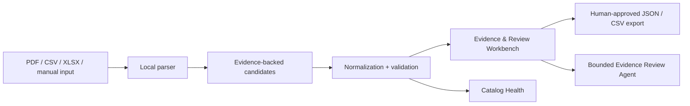

# VeriCatalog Proof

**Evidence-First Product Intelligence for Industrial Commerce**

VeriCatalog Proof is a local hackathon MVP for industrial valves and fittings. It turns a supplier PDF, CSV, XLSX, or manual partial entry into a PIM-ready product record while preserving the raw value, source snippet, source location, normalization explanation, validation result, truth status, and human review state for every field.

It is deliberately not a generic chat, RAG, product-copy generator, or production PIM integration. Its job is to make catalog attributes auditable before export.

It is prepared for the [UniHack 2026 industrial-commerce challenge](https://hack2skill.com/event/unilog2026) as a local-first trust layer between inconsistent supplier data and a structured product catalog.



## What the MVP demonstrates

- Three focused screens: **Enrich Product**, **Evidence & Review Workbench**, and **Catalog Health**
- Embedded-text and table-like PDFs, locally OCR-processed scanned pages when Tesseract is installed, CSV, simple XLSX, and manual partial-entry processing
- Conservative multi-SKU PDF segmentation: clearly repeated product cards and explicit table rows stay separate, and the reviewer selects the record to enrich
- Page-level PDF and row-level table evidence
- Deterministic normalization for metric/imperial size, material aliases, pressure notation, and temperature ranges
- Verified, Inferred, Missing, and Conflict truth statuses
- Required-field, type/unit, plausibility, cross-source conflict, and duplicate-candidate checks
- Approve, reject, and edit review actions persisted in local SQLite
- A bounded local **Evidence Review Agent** that inspects exceptions, provenance, and validation output; ranks human review tasks; and records its tool trace without changing any product value
- PIM-ready JSON/CSV product export and review-queue export
- A generated synthetic text PDF, deliberate conflicting CSV, and 60-row batch, all clearly labelled as synthetic

## Complete feature inventory

| Area | Implemented behaviour |
| --- | --- |
| File and manual intake | Accepts PDFs, CSVs, simple XLSX workbooks, and manual partial title/MPN input; returns useful input errors rather than fabricating a record. |
| PDF resilience | Reads embedded text with PyMuPDF; recognises explicit label/value pairs, table-like layouts, wrapped compact specification grids, and document identity cues; uses local Tesseract OCR for low-text scanned pages when installed. |
| PDF safety | A broad manual or product-family sheet may create an `Inferred` partial record, but unbound SKU data is never upgraded to `Verified` or invented. |
| SKU separation | Repeated labelled cards and explicit catalog-table rows become separate candidate records. The reviewer explicitly selects a record, so values from neighbouring SKUs cannot be silently merged. |
| Product schema | Handles manufacturer, manufacturer part number, title, product type, material, size, end connection, pressure rating, temperature range, certifications, and description. |
| Provenance | Every candidate retains its source file, page or row, source snippet, extraction method, raw value, normalized value, explanation, validation results, status, and review state. |
| Normalization | Converts metric/imperial size where safe, normalizes material aliases such as `SS304`/`AISI 304`, WOG/WSP pressure notation, end-connection labels, and temperature ranges. Family size ranges are preserved instead of being reduced to one SKU size. |
| Validation | Enforces required fields, type/unit parsing, valve plausibility, cross-source conflict detection, and duplicate-candidate detection. Competing evidence remains visible. |
| Human review | Per-field approve, reject, and edit actions persist in local SQLite with review notes and audit events; original evidence is never overwritten. |
| Batch intelligence | Computes product count, required-field completeness, fields requiring review, conflicts, missing mandatory fields, duplicate candidates, and prioritized review rows for CSV/XLSX batches. |
| Exports | Delivers PIM-ready product JSON, product CSV, and prioritized review-queue CSV exports. |
| Optional AI mapping | Uses an OpenAI-compatible backend-only candidate mapper only when configured. Returned values and quotes are independently grounded in the source, AI-only fields stay `Inferred`, and provider failures fall back to deterministic extraction. |
| Local-first privacy | SQLite, uploads, OCR, deterministic extraction, review history, and review-agent plans remain local. No cloud account, API key, or remote database is necessary for the default workflow. |
| Submission material | Includes Docker Compose setup, editable pitch deck, a rendered 90-second 1080p demo MP4, editable video source, visual QA snapshots, and synthetic demo files. |

## Local setup

Prerequisites: Node.js 20+ and Python 3.11+. Tesseract is optional but enables OCR for low-text scanned PDF pages.

```bash
git clone https://github.com/SoM1702/Vericatalogue.git
cd Vericatalogue
```

Terminal 1: backend

```bash
cd backend
python3 -m venv venv
source venv/bin/activate
pip install -r requirements.txt
uvicorn app.main:app --reload --port 8000
```

Terminal 2: frontend

```bash
cd frontend
npm install
npm run dev
```

Open `http://localhost:5173`.

If port 8000 is in use, pick another local API port and create `frontend/.env.local`:

```bash
VITE_API_PROXY_TARGET=http://127.0.0.1:8010
```

Then run the backend with `--port 8010` and restart the Vite development server. The development server proxies `/api` requests to the local backend, so it continues to work even if Vite needs to use port 5174 or another fallback port. `.env.example` lists the local-only server defaults. No API key, model credential, database server, or cloud account is required.

## Optional AI candidate mapping

The deterministic extractor is the default demo mode. To add your own OpenAI-compatible AI provider without exposing its key to the browser:

```bash
cd /path/to/Vericatalogue
cp backend/.env.example backend/.env
```

Edit `backend/.env` with your provider details:

```bash
VERICATALOG_AI_ENABLED=true
VERICATALOG_AI_API_KEY=your_key_here
VERICATALOG_AI_BASE_URL=https://your-provider.example/v1/chat/completions
VERICATALOG_AI_MODEL=your-model-id
```

Restart the backend. The UI then displays **AI candidate mapper**. The mapper can only add a value when its raw value and quoted snippet both occur in the uploaded source; its fields are always labelled **Inferred** and require review. A key never enters frontend code, browser storage, exports, logs, or version control. Keep `VERICATALOG_AI_BATCH_LIMIT=10` unless you intentionally want more provider calls for a batch.

Before a demo with a real provider, call `GET /api/ai/status`. It must report `configured: true` and the intended model; otherwise stay in deterministic proof mode. See [docs/14-ai-provider-preflight.md](docs/14-ai-provider-preflight.md) for the no-secret smoke check and failure cases.

## One-command judge setup

With Docker Desktop running, the complete local app is available without separately starting Python or Vite:

```bash
cd /path/to/Vericatalogue
docker compose up --build
```

Open <http://localhost:5173>. The browser communicates with the FastAPI service through the same-origin `/api` proxy, and SQLite/uploads stay in the named local Docker volume. Stop the containers with `docker compose down` when finished; this preserves the local volume.

The container setup starts in deterministic proof mode. To opt into the owner's ignored server-side model configuration, first create `backend/.env` from `backend/.env.example`, then run:

```bash
docker compose --env-file backend/.env up --build
```

No key is baked into an image or sent to the browser.

## API surface

FastAPI exposes interactive request/response documentation at `/docs` while the backend is running.

| Method | Endpoint | Purpose |
| --- | --- | --- |
| `GET` | `/health` | Local service status. |
| `GET` | `/api/ai/status` | AI configuration state only; never returns a key or provider URL. |
| `GET` | `/api/demo-files/{filename}` | Download a synthetic PDF or CSV demo input. |
| `POST` | `/api/enrich` | Enrich uploaded PDF/CSV/XLSX data or manual partial input; supports safe PDF `record_index` selection. |
| `POST` | `/api/batch` | Process a CSV/XLSX batch and return catalog-health metrics. |
| `GET` | `/api/products/{product_id}` | Retrieve a stored product record. |
| `PATCH` | `/api/products/{product_id}/attributes/{field}` | Approve, reject, or edit one field. |
| `POST` | `/api/products/{product_id}/review-agent/plan` | Run the bounded review agent. |
| `GET` | `/api/products/{product_id}/review-agent/latest` | Retrieve the latest persisted review-agent plan. |
| `GET` | `/api/products/{product_id}/export?format=json` or `format=csv` | Export a PIM-ready product record. |
| `GET` | `/api/review-queue/export` | Export the prioritized review queue. |

## Bounded Evidence Review Agent

After opening a record in **Evidence & Review Workbench**, choose **Run review agent**. It runs four named, local inspection tools in a fixed bounded sequence: identify exception fields, inspect retained provenance, evaluate validation output, and rank human actions. The resulting plan and tool trace are stored in SQLite so the reviewer can see why each task was prioritised.

This is intentionally an evidence-first agentic workflow, not an autonomous decision maker: it has no browser, shell, export, database-write, approval, or field-edit tools. It cannot invent facts, resolve a conflict, approve a field, or call an external model. It improves the review queue and demo story; it does **not** raise or claim extraction accuracy.

The persisted task plan is deliberately reproducible. Its four inspect-only tools are `identify_exceptions`, `inspect_provenance`, `evaluate_validation`, and `rank_human_actions`. Each task identifies an exception field, priority, evidence count, recommended human action, and reason.

## PDF intake boundaries

The PDF path first reads embedded text, then recognises explicit labels and table-like label/value pairs. It can also use locally installed Tesseract OCR for low-text scanned pages; no page image leaves the machine. A document-level heading or manufacturer cue may create an **Inferred** partial record for human review, but the app never upgrades that inference to `Verified` or invents a missing product specification. Clearly repeated product cards and explicit catalog table rows are returned as separate records; the UI requires the reviewer to select one SKU before enrichment, so values from neighboring rows are never merged. Broad manuals without clear product boundaries can therefore be accepted safely while leaving SKU-specific size, pressure, material, and end connection as `Missing` when the document does not tie them to one product.

## Demo path (three minutes)

1. On **Enrich Product**, choose **Load synthetic PDF**, then **Create evidence-backed record**. Choose **Try multi-SKU PDF** to demonstrate that two explicit product cards remain isolated and selectable.
2. Open **Inspect evidence**. Select **Pressure rating** to see its page-one snippet, deterministic validation, raw/canonical values, and review action.
3. To show a conflict, upload both generated files from `backend/demo_data/`: `synthetic_ball_valve_catalog.pdf` and `synthetic_conflicting_pressure.csv`. The same part number reports `600 WOG` versus `400 WOG` and must be reviewed. In the Workbench, choose **Run review agent** to show the stored, ranked human-action plan and its four-tool audit trace.
4. On **Catalog Health**, choose **Load synthetic batch** and process the 60-row batch. Filter the review queue and export it.

## Truth model

| Status | Meaning |
| --- | --- |
| Verified | Direct source evidence is retained and deterministic checks pass. |
| Inferred | A controlled title/category mapping yielded a plausible candidate, but it requires review. |
| Missing | No sufficient source evidence was found; the app does not fill a value. |
| Conflict | Sources disagree or a deterministic rule failed; all available evidence remains visible. |

The displayed confidence is a fixed, documented **review heuristic**, not an accuracy percentage or probability: direct evidence `0.95`, direct evidence after deterministic normalization `0.90`, inference `0.55`, missing `0.00`, and conflict/failing rule `0.25`.

## Test and build

```bash
cd backend
venv/bin/python -m pytest -q

cd ../frontend
npm run build
npm run lint
```

## Authorised real-world evaluation

The repository does not ship supplier data or an unmeasured “accuracy” number. It includes a local, reproducible evaluator that reads only an authorised, human-labelled ground-truth CSV and leaves its source files in place:

```bash
cd backend
venv/bin/python -m evaluation.run_evaluation /absolute/path/to/ground_truth.csv \
  --output /absolute/path/to/vericatalog-evaluation-output
```

See [backend/evaluation/README.md](backend/evaluation/README.md) for the required labels and responsible reporting boundary. Do not call any result “overall accuracy”; report the exact source set, inclusion rules, annotators, and field-level measures together. A deliberately limited public-datasheet smoke run and its reporting limits are recorded in [docs/13-public-document-smoke-evaluation.md](docs/13-public-document-smoke-evaluation.md).

The evaluator reports document acceptance, selected-record coverage, direct `Verified` precision/recall, `Inferred` candidate agreement, false-`Verified` rate, missing/conflict routing, and auditable per-field results. It never copies the evaluated source documents into this repository.

The documented public-datasheet smoke run matched 8/8 expected **Inferred** family-level candidates. That one-document result is not independently labelled and must not be represented as broad real-world accuracy.

## Scope and limitations

- Focused on industrial valves and fittings; it is not a generic document-intelligence product.
- Supports embedded-text/table-like PDFs, simple spreadsheets, manual partial input, and local OCR when Tesseract is available.
- It does not promise complete extraction from arbitrary manuals, drawings, image-only scans with poor OCR, or documents without product boundaries.
- The Evidence Review Agent helps a human prioritize work; it is intentionally not an autonomous decision maker.
- No production PIM/ERP connector, cloud deployment, or automatic external publishing is included in this MVP.
- All bundled catalog inputs are synthetic. Obtain authorization before evaluating private or licensed supplier data.

## Repository layout

```text
backend/app/        FastAPI API, parsing, normalization, validation, storage
backend/tests/      Deterministic unit/service/demo-input tests
backend/evaluation/ Authorised-data evaluator and ground-truth template (no real data included)
backend/demo_data/  Generated, clearly marked synthetic fixtures
frontend/src/       React TypeScript three-screen interface
docs/               Product, architecture, demo, evaluation, and deck materials
submission/         Final PPTX, its local screenshot assets, and submission handoff notes
videos/             Validated silent demo-video source, project assets, and visual QA snapshots
docker-compose.yml  One-command local full-stack setup
```

## Data provenance

All included product sources are intentionally fabricated synthetic demo data. They are not supplier catalog data and must not be used for real-world accuracy, business-impact, or data-quality claims. See [docs/02-hackathon-compliance.md](docs/02-hackathon-compliance.md) and [backend/demo_data/README.md](backend/demo_data/README.md).

## Documentation

The Stage 1 plan and handoff material live in `docs/`, including requirements, compliance, scope, user flows, schema and validation, architecture, evaluation, demo script, pitch-deck outline, a ready-to-paste [submission description](docs/SUBMISSION_DESCRIPTION.md), implementation plan, data sources, AI-provider preflight, real-PDF evaluation boundaries, and final submission checklist. The rendered editable deck, final MP4, and owner steps are in [submission/README.md](submission/README.md).
