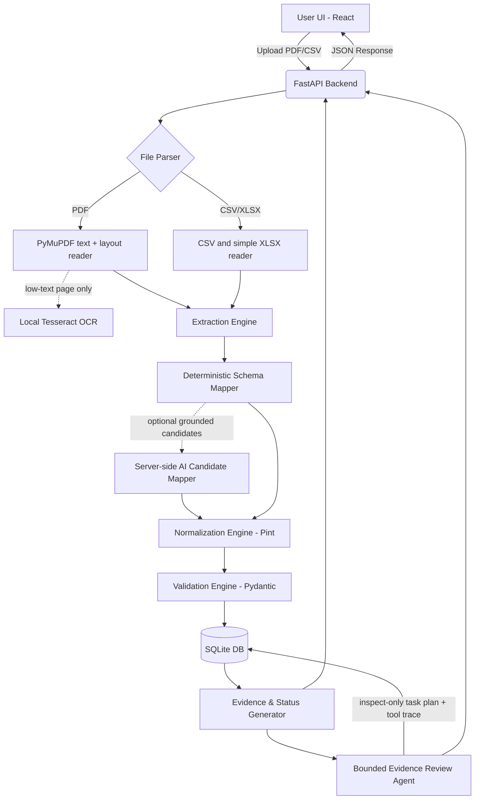

# System Architecture

## Tech Stack
- **Frontend**: React + TypeScript + Tailwind CSS (Vite)
- **Backend**: Python + FastAPI
- **Validation**: Pydantic
- **Unit Normalization**: Pint (Python unit registry)
- **Database**: SQLite (Local, with abstraction for future PG)
- **Extraction**: PyMuPDF text/layout reading with optional local Tesseract OCR for low-text scanned pages
- **LLM/AI Integration**: Optional local deterministic mode, or simple API call strictly for mapping text to schema (NOT source of truth).

## Architecture Diagram

## Data Provenance Strategy
- Extracted snippets are stored alongside the inferred structured value.
- The `Evidence & Status Generator` compares parsed values against defined rules to output the final auditable schema.
- No LLM, API key, vector database, or cloud service is required for the demo. When configured locally, the optional candidate mapper receives source text server-side and can only retain values and quotes independently found in that source; AI-only fields remain `Inferred` and cannot resolve a conflict or become `Verified`.

## Local API Boundary
The FastAPI service will expose a health endpoint; single-product enrichment; batch processing; product retrieval; review updates; product JSON/CSV export; and review-queue CSV export. CORS is restricted to local development origins. SQLite stores product records, evidence, validation outputs, and review decisions behind a repository layer that can later be swapped for PostgreSQL.

PDF layout fallback maps explicit table-like label/value pairs and document identity cues to `Inferred` candidates. It does not treat a broad technical manual as a single verified SKU: no evidence means `Missing`, and competing values remain `Conflict`.

## Review-Agent Boundary
The Review Agent is a fixed local sequence of four inspect-only tools, not an open-ended autonomous loop. It can query the enriched record's exceptions, provenance, and validation results, then persist a ranked task plan and audit trace. It has no product-mutation, approval, export, browser, shell, external-network, or model-invocation capability. This keeps the agentic workflow reproducible and makes human approval the only route to changing a record.
